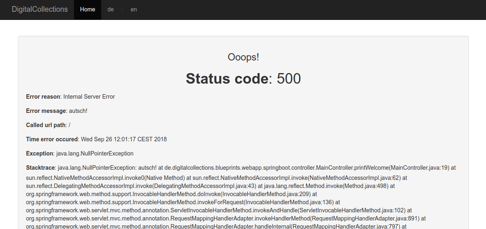

# Error handling

## Custom global error page

See <https://docs.spring.io/spring-boot/docs/current/reference/html/boot-features-developing-web-applications.html#boot-features-error-handling>,
<https://www.baeldung.com/spring-boot-custom-error-page>

By default we get the "Whitelabel error page" when an exception in the application occurs.
To replace it with an error page that uses our design / base template, we just place an `error.html` template in `src/main/resources/templates`.

File `src/main/resources/templates/error.html`:

```html
<!DOCTYPE html>
<html xmlns:th="http://www.thymeleaf.org"
      xmlns:layout="http://www.ultraq.net.nz/thymeleaf/layout"
      layout:decorate="~{base}">
  <body>
    <section layout:fragment="content">

      <h3>Uuups!</h3>
      
      <h1>Error <span th:text="${status}">404</span></h1>
      <p th:text="${error}">...</p>
      <p th:text="${message}">...</p>
      <p th:text="${path}">...</p>
      <p th:text="${timestamp}">...</p>
    </section>
  </body>
</html>
```

The default available model attributes are filled in the Spring Boot class `DefaultErrorAttributes`.
These are also all attributes you will see, when an error is returned in JSON-format:

```sh
$ curl -i http://localhost:9000/notExisting
HTTP/1.1 404 
Content-Type: application/json;charset=UTF-8
Transfer-Encoding: chunked
Date: Wed, 26 Sep 2018 06:58:05 GMT
Server: DigitalCollections: Blueprints 4: Webapp (Spring Boot + Thymeleaf) - Step 07 v1.0.0-SNAPSHOT

{"timestamp":"2018-09-26T06:58:05.910+0000","status":404,"error":"Not Found","message":"No message available","path":"/notExisting"}
```
Since Spring Boot shall be responsible for error management, it is important, that you don't implement a custom error controller and that
all controllers don't catch the errors in a try...catch stanza.

However, if you need to control the error handling, e.g. to display the 404 error page for certain conditions, you can manually throw
one of the Exceptions of `de.digitalcollections.commons.springmvc.exceptions`, like the `ResourceNotFoundException`.

### User friendly labeled error page

The above template just shows the technical values (attributes), so let's add some user friendly label texts:

```html
<!DOCTYPE html>
<html xmlns:th="http://www.thymeleaf.org"
      xmlns:layout="http://www.ultraq.net.nz/thymeleaf/layout"
      layout:decorate="~{base}">
  <body>
    <section layout:fragment="content">

      <div class="well">
        <h3 th:text="#{error.page_title}">Ooops!</h3>

        <h1>
          <label th:text="#{error.status_code}">Status code</label>: <span th:text="${status}">The status code</span>
        </h1>
        <p>
          <label th:text="#{error.reason}">Error reason</label>: <span th:text="${error}">The error reason</span>
        </p>
        <p>
          <label th:text="#{error.message}">Error message</label>: <span th:text="${message}">The exception message</span>
        </p>
        <p>
          <label th:text="#{error.url-path}">Called url path</label>: <span th:text="${path}">The URL path when the exception was raised</span>
        </p>
        <p>
          <label th:text="#{error.timestamp}">Time error occured</label>: <span th:text="${timestamp}">The time that the errors were extracted</span>
        </p>
      </div>
    </section>
  </body>
</html>
```

Additionally you have to add the translations to `messages.properties` (and all language derivats):

```ini
error.exception=Exception
error.message=Error message
error.page_title=Ooops!
error.reason=Error reason
error.stacktrace=Stacktrace
error.status_code=Status code
error.timestamp=Time error occured
error.url-path=Called url path
```

### Developer friendly error page with detailed information

Up to this point we display messages that might be informative for the user, but given informations
are not sufficient for real error debugging to developers.

For debugging the occured exception and stacktrace are needed.
But these informations should never show up (in production) to a user! (because the offer an insight into used technology and maybe attack targets...)

So we want the following behavior:

* Development environment ("local" and "DEV"): include and show exception and stacktrace
* Staging environment ("STG"): include and show exception and stacktrace only if special param is added to the request
* Production environment ("PROD"): never include and show exception or stacktrace

Spring Boot offers some configuration properties that are useful to achieve these goals (<https://docs.spring.io/spring-boot/docs/current/reference/html/common-application-properties.html>):

```ini
server.error.include-exception=false # Include the "exception" attribute.
server.error.include-stacktrace=never # When to include a "stacktrace" attribute.
server.error.path=/error # Path of the error controller.
server.error.whitelabel.enabled=true # Whether to enable the default error page displayed in browsers in case of a server error.
```

Available values for `include-stacktrace` are the lower case values of this enum <https://docs.spring.io/spring-boot/docs/current/api/org/springframework/boot/autoconfigure/web/ErrorProperties.IncludeStacktrace.html>:

* "always": Always add stacktrace information.
* "never": Never add stacktrace information.
* "on_trace_param": Add stacktrace information when the "trace" request parameter is "true".

We add our environment (profile) specific configurations to `application.yml`:

```yml
...
server:
  error:
    include-exception: true
    include-stacktrace: always

...
spring:
  profiles:
    active: local

---

spring:
  profiles: DEV

---

spring:
  profiles: STG

server:
  error:
    include-exception: false
    include-stacktrace: 'on_trace_param'

---

spring:
  profiles: PROD

server:
  error:
    include-exception: false
    include-stacktrace: 'never'
```

In staging environment the stacktrace will be added to error page if request param `trace` with value `true` is given.

At least we add the outputs conditionally to our template:

```html
<p th:if="${exception}">
  <label th:text="#{error.exception}">Exception</label>: <span th:text="${exception}">The class name of the root exception (if configured)</span>
</p>
<p th:if="${trace}">
  <label th:text="#{error.stacktrace}">Stacktrace</label>: <span th:text="${trace}">The exception stack trace</span>
</p>
```

To test it, we changed temporarily our controller code to throw a NullPointerException:

```java
@Controller
public class MainController {

  private static final Logger LOGGER = LoggerFactory.getLogger(MainController.class);

  @GetMapping(value = {"", "/"})
  public String printWelcome(Model model) {
    LOGGER.info("Homepage requested");
    model.addAttribute("time", new Date());
    throw new NullPointerException("ouch!");
//    return "main";
  }
}
```

You can test the conditional stacktrace with `http://localhost:9000/?trace=true` after temporarily changing
"include-stacktrace: 'on_trace_param'" in local profile in `application.yml`.

Don't forget to undo these changes after testing ;-)

To align labeled fields left, we change our CSS in `main.css` (and add class `error-page` to the root div in our template):

```css
.error-page p {
  text-align: left;
}
```



## Custom HTTP-status code specific error pages

See <https://docs.spring.io/spring-boot/docs/current/reference/html/boot-features-developing-web-applications.html#boot-features-error-handling-custom-error-pages>

"If you want to display a custom HTML error page for a given status code, you can add a file to an /error folder.
... The name of the file should be the exact status code or a series mask."

According to the HTTP-Statuscode 404 ("Not found") to handle, we add the file `src/main/resources/templates/error/404.html`:

```html
<!DOCTYPE html>
<html xmlns:th="http://www.thymeleaf.org"
      xmlns:layout="http://www.ultraq.net.nz/thymeleaf/layout"
      layout:decorate="~{base}">
  <body>
    <section layout:fragment="content">

      <div class="well">
        <h3 th:text="#{error.page_title}">Ooops!</h3>

        <h1 th:text="#{error.404.page_title}">Page not found</h1>
        
        <p>
          <a th:href="@{/}" class="btn btn-primary btn-lg">
            <span th:text="#{error.404.button_text}">Take Me Home</span>
          </a>
        </p>
      </div>
    </section>
  </body>
</html>
```

This page does not need all informations of the global error page, as the reason is simple: the called url is not known as page...
So we added just some specific text (see `messages.properties`) and a button to the homepage.

Screenshot of `http://localhost:9000/notExisting` call:


Other templates ("500.html", "5xx.html" etc.) can be added in same directory if required.

Feel free to change the 404-page according to your taste... (add some fun!)
