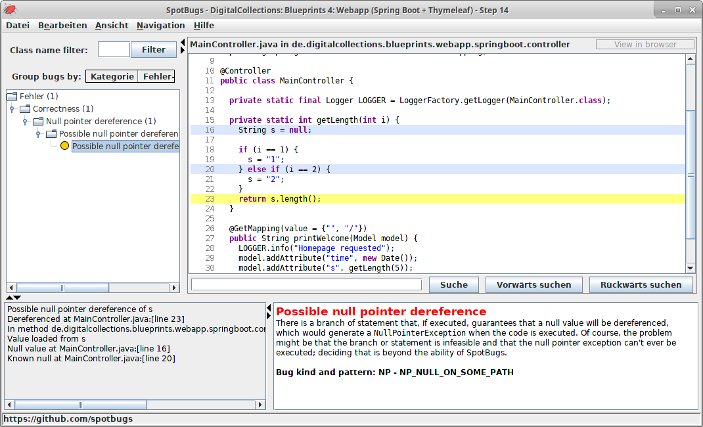

# Code Quality

This section covers the main code quality topics like check style or automatically finding bugs in software.

## fmt-maven-plugin

In order to have a uniform coding style across a software developer team, it is mandatory to agree on a specifiy ruleset. 
Thus, we at [DBMDZ](https://github.com/dbmdz) use the [fmt-maven-plugin](https://github.com/coveooss/fmt-maven-plugin) to 
format our Java code according to [Google's code styleguide](https://google.github.io/styleguide/javaguide.html). 

In this section the fmt-maven-plugin is used and integrated in the main `pom.xml`. Every time the software
is built, all Java files are automatically formatted. Additionally, we use the [githook-maven-plugin](https://github.com/phillipuniverse/githook-maven-plugin)
to automatically analyze and reformat the code before any changes are committed to the git repository.


### Integration

The following sections needs to be added to `pom.xml`:

```xml
<plugin>
<groupId>com.coveo</groupId>
<artifactId>fmt-maven-plugin</artifactId>
<version>2.10</version>
<executions>
  <execution>
    <goals>
      <goal>format</goal>
    </goals>
  </execution>
</executions>
</plugin>
<plugin>
<groupId>io.github.phillipuniverse</groupId>
<artifactId>githook-maven-plugin</artifactId>
<version>1.0.5</version>
<executions>
  <execution>
    <goals>
      <goal>install</goal>
    </goals>
    <configuration>
      <hooks>
        <pre-commit>
          if ! mvn com.coveo:fmt-maven-plugin:check ; then
          mvn com.coveo:fmt-maven-plugin:format
          echo -e "\e[31mCode has been reformatted to match code style\e[0m"
          echo -e "\e[31mPlease use git add … to add modified files\e[0m"
          echo "Your commit message was:"
          cat .git/COMMIT_EDITMSG
          exit 1
          fi
        </pre-commit>
      </hooks>
    </configuration>
  </execution>
</executions>
</plugin>

```

### Output

If any formatting errors are detected in code that is supposed to be committed, the fmt-maven-plugin reformats the code 
and alerts the user of the changes. The user is then prompted to add the modified files and commit them:

```bash
$ git commit -m "Update dependencies for step14"
[INFO] Scanning for projects...
....
[INFO] Processed 1 files (1 reformatted).
[INFO] ------------------------------------------------------------------------
[INFO] Reactor Summary for DigitalCollections: Blueprints 1.0.0-SNAPSHOT:
[INFO] 
...
[INFO] ------------------------------------------------------------------------
[INFO] BUILD SUCCESS
[INFO] ------------------------------------------------------------------------
[INFO] Total time:  2.352 s
[INFO] Finished at: 2020-08-27T17:20:37+02:00
[INFO] ------------------------------------------------------------------------
-e Code has been reformatted to match code style
-e Please use git add … to add modified files
Your commit message was:
Update dependencies for step14
```

## Spotbugs

SpotBugs is the successor of FindBugs and is a program which uses static analysis to look for bugs in Java code.

More information about SpotBugs website can be found [here](https://spotbugs.github.io/).

To enable it, just add the following section to your `<plugins>` section in `pom.xml`:

```xml
<plugin>
  <groupId>com.github.spotbugs</groupId>
  <artifactId>spotbugs-maven-plugin</artifactId>
  <version>3.1.8</version>
  <dependencies>
    <!-- overwrite dependency on spotbugs if you want to specify the version of spotbugs -->
    <dependency>
      <groupId>com.github.spotbugs</groupId>
      <artifactId>spotbugs</artifactId>
      <version>3.1.9</version>
    </dependency>
  </dependencies>
</plugin>
```

This configuration is a very strict and the Maven build automatically fails, whenever SpotBugs found any errors.

To allow SpotBugs not to fail on errors, just use:

```xml
<plugin>
  <groupId>com.github.spotbugs</groupId>
  <artifactId>spotbugs-maven-plugin</artifactId>
  <version>3.1.8</version>
  <dependencies>
    <!-- overwrite dependency on spotbugs if you want to specify the version of spotbugs -->
    <dependency>
      <groupId>com.github.spotbugs</groupId>
      <artifactId>spotbugs</artifactId>
      <version>3.1.9</version>
    </dependency>
  </dependencies>
  <configuration>
    <failOnError>false</failOnError>
  </configuration>
  <executions>
    <execution>
      <goals>
        <goal>check</goal>
      </goals>
    </execution>
  </executions>
</plugin>
```

### Checks

To show the powerful static analysis for SpotBugs, we intentionally add a null pointer dereference bug:

```java
  private static int getLength(int i) {
    String s = null;

    if (i == 1) {
      s = "1";
    } else if (i == 2) {
      s = "2";
    }
    return s.length();
  }
```

As you can see in the example above, a null pointer dereference could occur when variable `i` is not set to `1` or `2`.

To execute the SpotBugs analysis just execute:

```bash
$ mvn spotbugs:check
```

Then a static analysis of the code is done and it will output the following:

```bash
[INFO] --- spotbugs-maven-plugin:3.1.8:check (default-cli) @ webapp-springboot-thymeleaf ---
[INFO] BugInstance size is 1
[INFO] Error size is 0
[INFO] Total bugs: 1
[ERROR] Possible null pointer dereference of s in de.digitalcollections.blueprints.webapp.springboot.controller.MainController.getLength(int) [de.digitalcollections.blueprints.webapp.springboot.controller.MainController, de.digitalcollections.blueprints.webapp.springboot.controller.MainController, de.digitalcollections.blueprints.webapp.springboot.controller.MainController] Dereferenced at MainController.java:[line 23]Null value at MainController.java:[line 16]Known null at MainController.java:[line 20] NP_NULL_ON_SOME_PATH
[INFO] 


To see bug detail using the Spotbugs GUI, use the following command "mvn spotbugs:gui"
```

Thus, SpotBugs was able to detect this null pointer dereference 🤗

**Notice**: In order to get a correct SpotBugs analysis, the `mvn clean install` command needs to be executed sucessfully.

### GUI

After running the `spotbugs:check` it is also possible to run a graphical user interface, that provides more information about a specific error:



The graphical user interface is shown after invoking the following command:

```bash
$ mvn spotbugs:gui
```

### Advanced

In some cases it is necessary to suppress warnings/errors that were found by SpotBugs. They can be disabled by using Java annotations. Here comes
a list of possible annotations:


* `CheckForNull`
* `CheckReturnValue`
* `CleanupObligation`
* `Confidence`
* `CreatesObligation`
* `DefaultAnnotation`
* `DefaultAnnotationForFields`
* `DefaultAnnotationForMethods`
* `DefaultAnnotationForParameters`
* `DesireNoWarning`
* `DesireWarning`
* `DischargesObligation`
* `ExpectWarning`
* `NonNull`
* `NoWarning`
* `Nullable`
* `OverrideMustInvoke`
* `PossiblyNull`
* `Priority`
* `ReturnValuesAreNonnullByDefault`
* `SuppressFBWarnings`
* `SuppressWarnings`
* `UnknownNullness`
* `When`

E.g. the `SuppressFBWarnings` can be used to disable a SpotBugs check for a specific member variable:

```java
@JsonProperty
@SuppressFBWarnings
private String details;
```

In order to use SpotBugs annotations, the `spotbugs-annotations` package must be added to `pom.xml`:

```xml
<dependency>
  <groupId>com.github.spotbugs</groupId>
  <artifactId>spotbugs-annotations</artifactId>
  <version>3.1.10</version>
  <optional>true</optional>
</dependency>
```